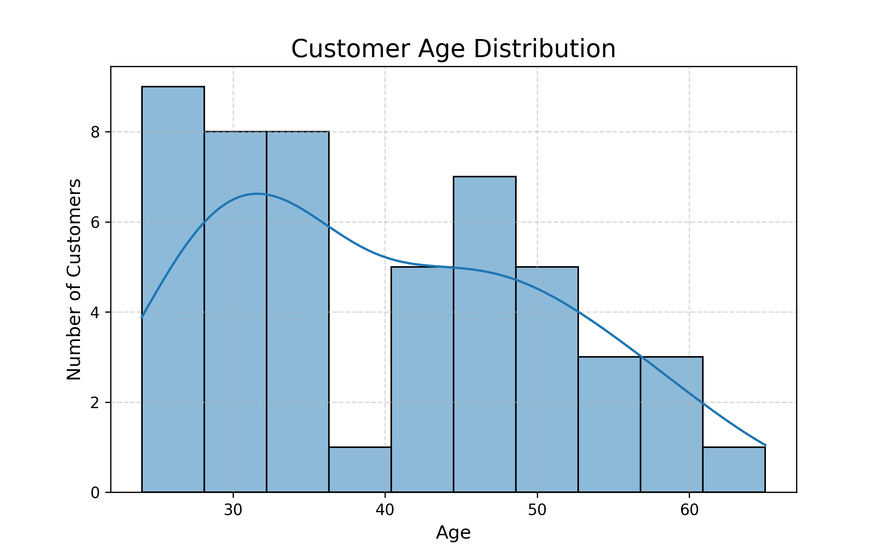
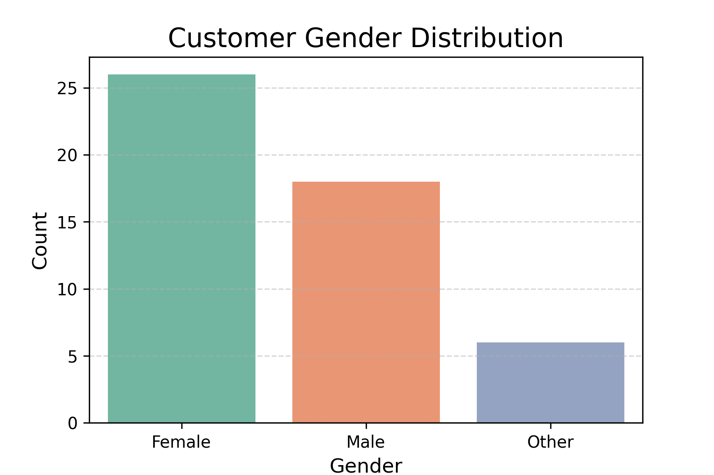
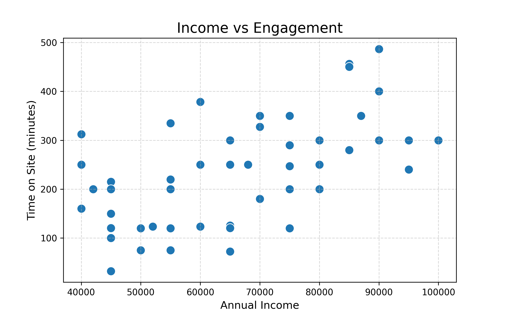
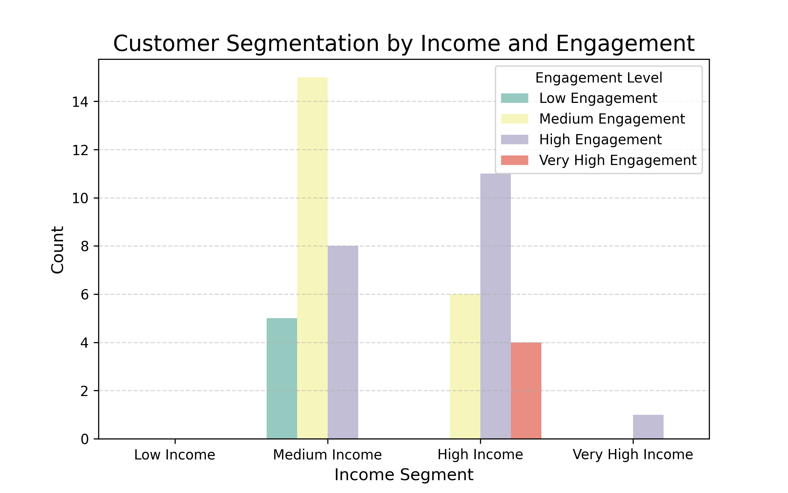
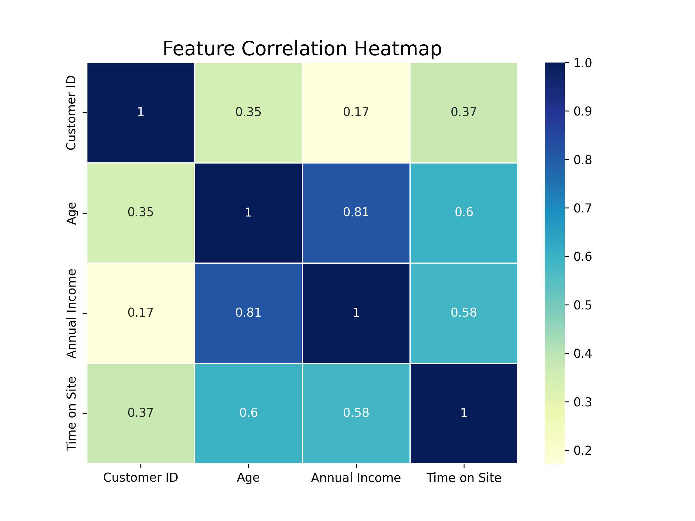
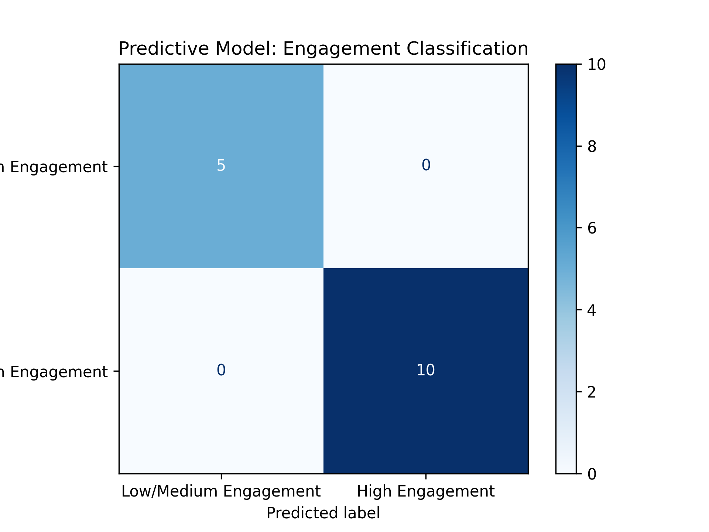

# E-Commerce Customer Behavior Analysis

 Project Overview
This project presents an exploratory and predictive analysis of customer behavior data
from an e-commerce platform. The objective is to understand how demographic factors,
income levels, and user engagement relate to customer behavior, and to demonstrate
practical data analysis skills using Python.

The analysis was performed in Google Colab using a single structured dataset and focuses
on data cleaning, visualization, segmentation, and basic predictive modeling.

# Business Problem
The objective of this analysis is to understand how customer demographics
and income influence engagement behavior on an e-commerce platform.
The insights can help businesses improve customer targeting, engagement,
and retention strategies.

Dataset Description
- Dataset name: E-commerce Customer Behaviour Dataset  
- File used: `E-commerce_cleaned_segments.csv`  
- Number of records: 50 customers  
- Data type: Structured CSV  

Features included:
- Customer ID  
- Age  
- Gender  
- Location  
- Annual Income  
- Purchase History  
- Browsing History  
- Product Reviews  
- Time on Site  

The dataset contains no missing values and was suitable for direct exploratory analysis.

 Methodology and Analysis
The following steps were carried out during the analysis:

1. Data Loading and Inspection
   - Loaded the dataset using Pandas
   - Checked data types, structure, and basic statistics
   - Verified absence of missing values
   - Removed duplicate records

2. Exploratory Data Analysis (EDA)
   - Distribution analysis of age and gender
   - Relationship analysis between income and time spent on site
   - Visualization of customer engagement patterns

3. Customer Segmentation
   - Customers were grouped based on income and engagement metrics
   - Segmentation helped identify potential high-value customer groups

4. Correlation Analysis
   - A correlation heatmap was used to understand relationships between numerical variables

5. Predictive Modeling
   - A simple classification model was built to predict customer engagement level
   - Model performance was evaluated using a confusion matrix

## Key Findings
- Customers with higher annual income generally show higher engagement
- Time spent on site is positively associated with customer value
- Clear segmentation patterns are visible even in a small dataset
- Simple predictive models can provide useful insights into customer behavior

 Visual Outputs
The following visualizations were generated during the analysis:

# Age Distribution

This visualization shows that most customers fall between the ages of 25 and 40,
indicating a digitally active customer base that is likely to engage frequently
with online shopping platforms.

# Gender Distribution

The gender distribution appears relatively balanced, suggesting that the
e-commerce platform attracts customers across genders without strong bias.

# Income vs Engagement

This chart indicates a positive relationship between annual income and time spent
on the website, suggesting that higher-income customers tend to be more engaged.

# Customer Segmentation

Customers are clearly grouped into low, medium, and high segments based on income
and engagement, enabling targeted marketing and personalized strategies

# Correlation Heatmap

The heatmap highlights time on site and annual income as key variables associated
with customer engagement, supporting data-driven segmentation decisions.

# Predictive Model Confusion Matrix

The confusion matrix demonstrates that the predictive model can reasonably
distinguish high-engagement customers using demographic and income features.

Tools and Technologies
- Python  
- Pandas, NumPy  
- Matplotlib, Seaborn  
- Scikit-learn  
- Google Colab  

# Author
Malaika Shaikh  
Interest Areas: Data Analysis, Bioinformatics, Applied Analytics

# Project Purpose
This project was developed as a portfolio case study to demonstrate:
- Data cleaning and preprocessing
- Exploratory data analysis
- Visualization skills
- Basic machine learning application
- Clear communication of analytical findings

# Results & Business Impact
- Identified high-engagement customer segments based on income and time on site
- Highlighted time on site as a strong indicator of customer value
- Demonstrated how data-driven segmentation can support targeted marketing
- Built a basic predictive model to classify high-engagement users

